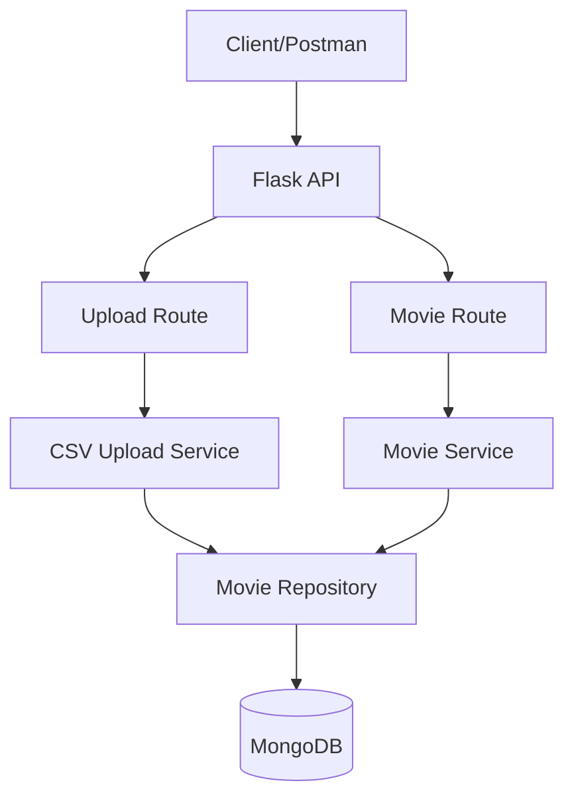
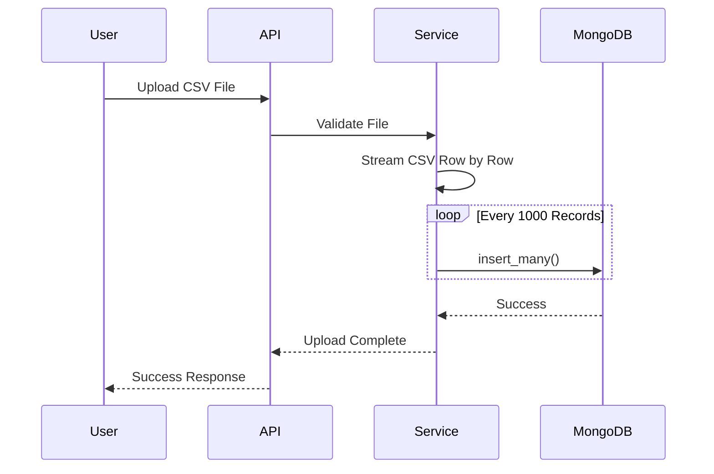

# IMDb Content Upload System

## Overview

A Flask-based content management system that allows IMDb content teams to upload movie/show data through CSV files and retrieve the data using paginated, filterable, and sortable APIs.

### Features

* CSV Upload API
* MongoDB Storage
* Streaming CSV Processing
* Batch Inserts
* Pagination
* Filtering by Release Year
* Filtering by Language
* Sorting by Release Date
* Sorting by Rating
* Layered Architecture (Route → Service → Repository)

---

## Tech Stack

* Python 3.12
* Flask
* MongoDB
* PyMongo
* Docker (Optional)

---

## System Architecture



---

## CSV Upload Flow



---

## Movie Retrieval Flow


---

## Project Structure

```text
imdb-content-system/
│
├── app.py
├── requirements.txt
├── .env
│
├── config/
│   ├── database.py
│   └── settings.py
│
├── routes/
│   ├── upload_routes.py
│   └── movie_routes.py
│
├── services/
│   ├── csv_upload_service.py
│   └── movie_service.py
│
├── repositories/
│   └── movie_repository.py
│
├── utils/
│   ├── response.py
│   └── exceptions.py
│
├── uploads/
│
└── tests/
```

---

## Setup

### Clone Repository

```bash
git clone <repository-url>
cd imdb-content-system
```

### Create Virtual Environment

```bash
python -m venv venv
```

### Activate Environment

Windows

```bash
venv\Scripts\activate
```

Linux/Mac

```bash
source venv/bin/activate
```

### Install Dependencies

```bash
pip install -r requirements.txt
```

### Configure Environment Variables

Create `.env`

```env
MONGO_URI=mongodb://localhost:27017
DB_NAME=imdb_db
```

### Run Application

```bash
python app.py
```

---

## API Documentation

### Upload CSV

```http
POST /api/v1/upload
```

Request Body:

```form-data
file : movies.csv
```

Response:

```json
{
  "success": true,
  "message": "CSV uploaded successfully"
}
```

---

### Get Movies

```http
GET /api/v1/movies
```

#### Query Parameters

| Parameter | Description           |
| --------- | --------------------- |
| page      | Page number           |
| limit     | Records per page      |
| year      | Release year filter   |
| language  | Language filter       |
| sort_by   | release_date / rating |
| order     | asc / desc            |

Example:

```http
GET /api/v1/movies?page=1&limit=10&language=English&year=2024&sort_by=rating&order=desc
```

---

## Database Indexes

```javascript
db.movies.createIndex({ release_year: 1, language: 1 })

db.movies.createIndex({ release_date: -1 })

db.movies.createIndex({ rating: -1 })
```

---

## Design Decisions

### Streaming CSV Processing

The system processes CSV files using Python's `csv.DictReader` and reads records sequentially instead of loading the entire file into memory.

### Batch Inserts

Records are inserted into MongoDB in batches of 1000 documents using `insert_many()` to improve write performance.

### Layered Architecture

Responsibilities are separated into Routes, Services, and Repositories to improve maintainability and testability.

### Scalability Consideration

For very large files (up to 1GB), a production-ready solution would process uploads asynchronously using a message queue and worker process to avoid blocking HTTP requests.

---

## Testing

A Postman collection is included in the repository for API testing.

---

## Future Improvements

* Background CSV Processing
* Upload Status Tracking
* Authentication & Authorization
* API Rate Limiting
* Caching Layer
* Bulk Data Validation


## Running Tests

```bash
pytest
```

Run specific test:

```bash
pytest tests/test_upload_api.py
```

```
```
